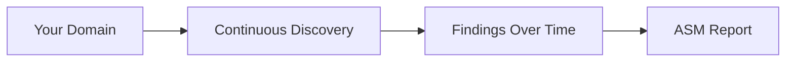

---
title: "ASM Reports"
description: "What's inside an Attack Surface Assessment report, and how it differs from a Pentest report."
---

Not sure what ASM is yet? See [What is Attack Surface Management?](/what-is-asm) first.

Your **Attack Surface Assessment report** summarizes everything discovered and tested across your organisation's exposed assets.

## How It's Different

Unlike a Pentest report, which covers a fixed set of declared targets tested once, an ASM report reflects an evolving picture of your attack surface:

| | ASM Report | Pentest Report |
|---|---|---|
| **Scope** | Continuously discovered assets | Targets you declared |
| **Findings** | Tied to your evolving external attack surface | Tied to specific tested targets |
| **Frequency** | Can reflect ongoing/recurring scan results | One report per audit |

## What's Inside

<Note>
We're confirming the exact section breakdown of the ASM report PDF with the product team — this will be updated once we've reviewed a real generated report.
</Note>

<Frame>
  
</Frame>

## Finding Your ASM Reports

ASM reports appear alongside your other reports on the **Reports** page — see [Understanding Your Audit Reports](/generating-reports) for how to find and download them.

## FAQ

<AccordionGroup>
  <Accordion title="How often is my ASM report updated?">
    This depends on your scan schedule — see [Scheduling & Results](/scheduling-results) for one-shot vs recurring scans.
  </Accordion>
  <Accordion title="Can I compare two ASM reports over time?">
    We're confirming this capability with the product team.
  </Accordion>
</AccordionGroup>