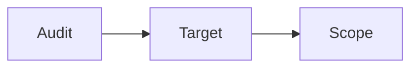

Before you start your first audit, it helps to understand three simple ideas: what an audit is, what a target is, and what scope means. If you'd rather jump straight into the step-by-step form, see [Starting an Audit](/starting-an-audit) — this page explains the concepts behind it.

Think of it like this: an **audit** is the overall project. Inside that project, you first define your **targets** — the actual systems you want tested (like your website or app). Then you set the **scope** — the ground rules for how those targets will be tested.

## Creating an Audit

Here's what happens when you create a new audit:

<Steps>
  <Step title="Start a new audit">
    From your dashboard, click **Start an Audit**. This opens a new, empty audit that you'll fill in over the next few steps.
  </Step>
  <Step title="Give it a name and type">
    Name your audit so you can recognize it later, and choose what kind of audit it is (see Audit Categories below).
  </Step>
  <Step title="Define your targets">
    Next, you'll add the targets — the systems you want tested.
  </Step>
  <Step title="Move on to scope">
    Finally, you'll define the scope — the rules for how testing should be carried out.
  </Step>
</Steps>

<Frame>
  
</Frame>

## Defining Scope

The scope answers two questions: what will be tested, and what rules must the testing team follow?

### What will be tested (your targets)

A target is simply a system you want tested — your website, an app, a server, etc. For each one, you'll be asked a few simple questions:

- What kind of system is it? (a website, a mobile app, an API, a cloud system, or something hosted on your own servers)
- The basics — its name, where it's used (e.g. live/production), its web address, and a short description
- How sensitive is it? — a few quick ratings that help the testing team know how careful to be and what to prioritize

You can list more than one target if you want several systems tested as part of the same audit.

### The rules for testing (Rules of Engagement)

This is simply the list of ground rules for the testing team — what they're allowed to do, and what's completely off-limits. You'll be asked things like:

- What protections do you already have in place? (e.g. a firewall) — so the team knows what they're working around
- What's strictly forbidden? — anything you don't want them to try, no matter what
- What worries you most? — the outcomes you most want to avoid, so the team knows what to focus on protecting against

<Frame>
  
</Frame>

## Keeping Your Data Private

You might wonder: if other companies also use Rifteo, could they ever see your systems or your test results? The answer is no.

Everything you set up — your targets, your rules, your results — is only ever visible to your own organisation.

No other Rifteo client can see, access, or test your systems, and you can't see theirs either.

This separation happens automatically. There's nothing extra you need to set up to keep your information private.

## Audit Categories

When you create an audit, you'll choose one of three types:

| Category | What it means | Best for |
|----------|-----------------|----------|
| **Pentest** | Security experts actively try to break into a specific system, the way a real attacker might. | Getting a deep, hands-on test of one specific app or system. |
| **Vulnerability Assessment** | An automated scan checks your systems for known weaknesses, without actively trying to break in. | A quicker, broader check across your systems. |
| **Attack Surface Assessment** | Ongoing monitoring of everything you have exposed to the internet, so you always know what's visible to potential attackers. | Staying continuously aware, instead of a one-time check. |

The type you choose affects what options you'll see next, and how your final report will look.