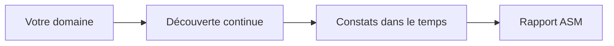

Vous ne savez pas encore ce qu'est l'ASM ? Consultez d'abord [Qu'est-ce que la gestion de surface d'attaque ?](/fr/what-is-asm).

Votre **rapport d'évaluation de surface d'attaque** résume tout ce qui a été découvert et testé sur les actifs exposés de votre organisation.

## Différences

Contrairement à un rapport de test d'intrusion, qui couvre un ensemble fixe de cibles déclarées et testées une fois, un rapport ASM reflète une image évolutive de votre surface d'attaque :

| | Rapport ASM | Rapport de test d'intrusion |
|---|---|---|
| **Périmètre** | Actifs découverts en continu | Cibles que vous avez déclarées |
| **Constats** | Liés à l'évolution de votre surface d'attaque externe | Liés à des cibles testées spécifiques |
| **Fréquence** | Peut refléter des scans continus ou récurrents | Un rapport par audit |

## Contenu

<Note>
Nous confirmons le découpage exact du PDF de rapport ASM avec l'équipe produit. Cette page sera mise à jour après revue d'un rapport réellement généré.
</Note>

<Frame>
  
</Frame>

## Trouver vos rapports ASM

Les rapports ASM apparaissent avec vos autres rapports sur la page **Rapports**. Voir [Comprendre vos rapports d'audit](/fr/generating-reports) pour savoir comment les trouver et les télécharger.

## FAQ

<AccordionGroup>
  <Accordion title="À quelle fréquence mon rapport ASM est-il mis à jour ?">
    Cela dépend de votre planification de scan. Voir [Planification et résultats](/fr/scheduling-results) pour comprendre les scans ponctuels et récurrents.
  </Accordion>
  <Accordion title="Puis-je comparer deux rapports ASM dans le temps ?">
    Nous confirmons cette possibilité avec l'équipe produit.
  </Accordion>
</AccordionGroup>
