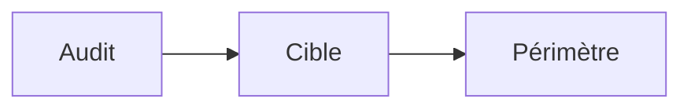

Avant de commencer votre premier audit, il est utile de comprendre trois notions simples : ce qu'est un audit, ce qu'est une cible et ce que signifie le périmètre. Si vous préférez passer directement au formulaire étape par étape, consultez [Démarrer un audit](/fr/starting-an-audit). Cette page explique les concepts derrière le processus.

Voyez les choses ainsi : un **audit** est le projet global. Dans ce projet, vous définissez d'abord vos **cibles**, c'est-à-dire les systèmes à tester, comme votre site web ou votre application. Vous définissez ensuite le **périmètre**, c'est-à-dire les règles qui encadrent les tests.

## Créer un audit

Voici ce qui se passe lorsque vous créez un audit :

<Steps>
  <Step title="Démarrer un nouvel audit">
    Depuis votre tableau de bord, cliquez sur **Démarrer un audit**. Cela ouvre un nouvel audit vide que vous complétez au fil des étapes.
  </Step>
  <Step title="Nommer l'audit et choisir son type">
    Donnez un nom reconnaissable à votre audit, puis choisissez son type (voir Catégories d'audit ci-dessous).
  </Step>
  <Step title="Définir vos cibles">
    Ajoutez ensuite les cibles, c'est-à-dire les systèmes que vous voulez tester.
  </Step>
  <Step title="Passer au périmètre">
    Définissez enfin le périmètre, soit les règles qui encadrent les tests.
  </Step>
</Steps>

<Frame>
  
</Frame>

## Définir le périmètre

Le périmètre répond à deux questions : qu'est-ce qui sera testé, et quelles règles l'équipe de test doit-elle suivre ?

## Comment l'audit est réalisé

Une fois le périmètre confirmé, les tests suivent une méthodologie reconnue internationalement : **PTES** (Penetration Testing Execution Standard). Elle découpe le travail en sept phases afin que vous sachiez toujours où en est votre audit.

Voici comment ces phases correspondent au statut visible dans votre tableau de bord :

| Phase PTES | Ce qui se passe | Statut visible |
|---|---|---|
| 1. Pré-engagement | Votre périmètre et vos règles d'engagement sont confirmés | Planifié (`PLANNED`) |
| 2. Collecte d'information | L'équipe étudie vos systèmes | En cours (`IN_PROGRESS`) |
| 3. Modélisation des menaces | L'équipe cartographie les chemins d'attaque probables | En cours (`IN_PROGRESS`) |
| 4. Analyse des vulnérabilités | L'équipe recherche les faiblesses | En cours (`IN_PROGRESS`) |
| 5. Exploitation | L'équipe tente d'exploiter les faiblesses trouvées | En cours (`IN_PROGRESS`) |
| 6. Post-exploitation | L'équipe évalue l'impact réel de ses découvertes | En cours (`IN_PROGRESS`) |
| 7. Rapport | Les constats sont rédigés et revus avant de vous être partagés | En revue (`IN_REVIEW`) → Terminé (`COMPLETED`) |

Vous n'avez aucune action à réaliser pendant ces phases. Le statut du tableau de bord vous tient informé, et vous êtes notifié lorsque les résultats sont prêts.

### Ce qui sera testé : vos cibles

Une cible est simplement un système que vous voulez tester : site web, application, serveur, etc. Pour chaque cible, quelques informations vous seront demandées :

- Le type de système : site web, application mobile, API, système cloud ou infrastructure hébergée chez vous
- Les informations de base : nom, environnement d'utilisation (par exemple production), adresse web et courte description
- Sa sensibilité : quelques évaluations rapides pour aider l'équipe de test à savoir avec quelle prudence agir et quoi prioriser

Vous pouvez lister plusieurs cibles si vous voulez tester plusieurs systèmes dans le même audit.

### Les règles de test : règles d'engagement

Il s'agit des règles de base données à l'équipe de test : ce qu'elle peut faire et ce qui est interdit. Vous devrez indiquer par exemple :

- Les protections déjà en place, comme un pare-feu, pour que l'équipe sache avec quoi elle travaille
- Ce qui est strictement interdit, c'est-à-dire ce que vous ne voulez pas que l'équipe tente
- Ce qui vous inquiète le plus, afin que l'équipe sache quels scénarios prioriser

<Frame>
  
</Frame>

## Garder vos données privées

Vous pouvez vous demander si d'autres entreprises utilisant Rifteo pourraient voir vos systèmes ou vos résultats de test. La réponse est non.

Tout ce que vous configurez, vos cibles, vos règles et vos résultats, est uniquement visible par votre propre organisation.

Aucun autre client Rifteo ne peut voir, accéder ou tester vos systèmes, et vous ne pouvez pas voir les siens.

Cette séparation est automatique. Vous n'avez rien de plus à configurer pour garder vos informations privées.

## Catégories d'audit

Lorsque vous créez un audit, vous choisissez l'un des trois types suivants :

| Catégorie | Signification | Idéal pour |
|-----------|---------------|------------|
| **Test d'intrusion** | Des experts sécurité tentent activement de s'introduire dans un système précis, comme le ferait un vrai attaquant. | Obtenir un test approfondi et manuel d'une application ou d'un système spécifique. |
| **Évaluation de vulnérabilités** | Un scan automatisé vérifie les vulnérabilités connues de vos systèmes, sans tenter de les exploiter activement. | Réaliser un contrôle plus rapide et plus large de vos systèmes. |
| **Évaluation de surface d'attaque** | Surveillance continue de tout ce que vous exposez à internet, pour toujours savoir ce qui est visible par des attaquants potentiels. | Garder une conscience continue de votre exposition, au lieu d'un contrôle ponctuel. |

Le type choisi influence les options affichées ensuite et la forme de votre rapport final.
