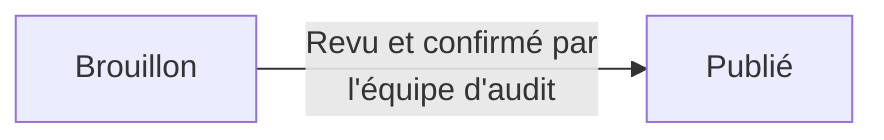

Une fois que votre équipe d'audit publie les résultats, ils apparaissent dans votre **tableau de bord des constats**. Cette page explique comment le lire pour comprendre rapidement ce qui a été trouvé, la gravité de chaque problème et ce que cela signifie pour vous.

## Types de constat

Chaque constat est aussi classé par **type**, ce qui indique la nature du problème de sécurité :

| Type | Signification |
|------|---------------|
| **Vulnérabilité** | Faiblesse identifiée dans vos systèmes, potentiellement exploitable par un attaquant. |
| **Exploitation** | L'équipe d'audit a exploité une vulnérabilité avec succès pour démontrer un impact réel et confirmé, pas seulement un risque théorique. |
| **Hypothèse de menace** | Scénario de risque potentiel identifié par l'équipe d'audit. Il n'est pas directement confirmé comme exploitable, mais mérite d'être traité par précaution. |
| **Observation** | Ce n'est pas une vulnérabilité : note, recommandation de bonnes pratiques ou point à connaître. |
| **Réussite** | Contrôle de sécurité ou bonne pratique déjà correctement mis en place et confirmé par l'équipe d'audit. Ce n'est pas un problème, mais il est utile de savoir ce qui fonctionne déjà bien. |

Vous pouvez filtrer le tableau de bord par type avec le filtre **Type** au-dessus de la liste des constats.

<Tip>
Les constats de type **Réussite** ont généralement une sévérité **Information**. Ils indiquent ce qui est déjà sécurisé, pas ce qui doit être corrigé.
</Tip>

<Frame>
  
</Frame>

## Niveaux de sévérité

Chaque constat reçoit un niveau de sévérité afin de vous aider à comprendre son urgence.

| Sévérité | Signification | Exemple |
|----------|---------------|---------|
| **Critique** | Peut permettre à un attaquant de prendre le contrôle complet d'un système ou d'accéder immédiatement à des données très sensibles. À traiter sans délai. | Panneau d'administration exposé sans mot de passe. |
| **Élevée** | Faiblesse sérieuse, probablement exploitable, pouvant causer des dommages réels. | Page de connexion vulnérable aux attaques par devinette de mot de passe. |
| **Moyenne** | Problème réel, mais plus difficile à exploiter ou avec un impact plus limité. | En-têtes de sécurité manquants qui facilitent certaines attaques. |
| **Faible** | Faiblesse mineure, peu susceptible de causer des dommages seule. | Version logicielle obsolète sans exploit actif connu. |
| **Information** | Pas une vulnérabilité, mais une bonne pratique utile à connaître. | Recommandation d'activer des logs supplémentaires. |

## Scores CVSS

En plus de la sévérité, vous pouvez voir un **score CVSS** : un nombre de 0 à 10 qui mesure la gravité d'une vulnérabilité.

- **0.1 – 3.9** → Faible
- **4.0 – 6.9** → Moyenne
- **7.0 – 8.9** → Élevée
- **9.0 – 10.0** → Critique

Vous n'avez pas besoin de le calculer vous-même. Rifteo l'affiche automatiquement à côté de chaque constat. Considérez-le comme une version plus précise du niveau de sévérité : deux constats **élevés** peuvent avoir des scores CVSS différents selon leur facilité d'exploitation.

## Brouillon vs publié

Les constats passent par deux étapes :

- **Brouillon** : l'équipe d'audit vérifie encore le constat. Les brouillons sont privés et visibles uniquement par l'équipe d'audit.
- **Publié** : le constat a été revu et confirmé. Vous ne voyez que les constats **publiés** dans votre tableau de bord, afin de ne jamais recevoir un problème avant validation.

<Note>
Si un constat n'apparaît pas encore, il est peut-être toujours en brouillon. L'équipe d'audit confirme probablement les détails avant publication.
</Note>

## Comprendre les recommandations, les risques et la conformité

Chaque constat publié contient plus qu'une simple description du problème :

- **Recommandation** : conseils pratiques de l'équipe d'audit pour corriger le problème
- **Risque** : explication simple de ce qui pourrait arriver si le problème n'est pas traité
- **Conformité** : lorsque pertinent, standards ou réglementations liés au constat (par exemple RGPD ou ISO 27001), pour prioriser selon vos obligations de conformité

Ce contexte vous aide, avec votre équipe technique, à décider quoi corriger en premier.

<Note>
Les actions directes de remédiation, comme marquer un constat comme résolu, sont en cours de refonte et ne sont pas encore disponibles.
Si vous avez une question ou une inquiétude sur un constat précis, laissez un commentaire dans le fil d'audit pour échanger directement avec l'équipe d'audit.
</Note>

## FAQ

<AccordionGroup>
  <Accordion title="Pourquoi ne vois-je pas un constat mentionné par mon auditeur ?">
    Il est probablement encore en brouillon. Les constats n'apparaissent dans votre tableau de bord qu'une fois revus et publiés.
  </Accordion>
  <Accordion title="Que dois-je corriger en premier ?">
    Commencez par les constats **critiques** et **élevés**, qui portent le plus de risque. Le score CVSS peut vous aider à prioriser davantage au sein d'un même niveau.
  </Accordion>
  <Accordion title="Puis-je marquer moi-même un constat comme résolu ?">
    Pas encore. Cette fonctionnalité est en cours de refonte. En attendant, laissez un commentaire dans le fil d'audit pour informer l'équipe.
  </Accordion>
  <Accordion title="Et si je ne suis pas d'accord avec la sévérité d'un constat ?">
    Laissez un commentaire dans le fil d'audit en expliquant votre raisonnement. L'équipe d'audit pourra revoir et clarifier.
  </Accordion>
</AccordionGroup>
