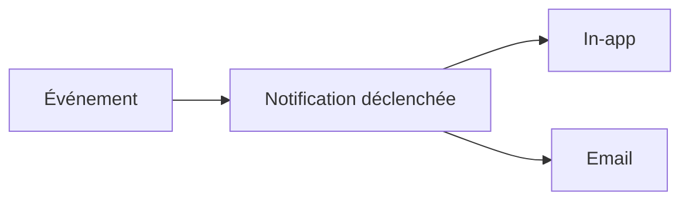

Rifteo vous tient informé de ce qui se passe sur vos audits grâce aux notifications. Cette page explique ce qui déclenche une notification et comment les contrôler.

## Catégories de notification

Les notifications sont regroupées en quatre catégories :

| Catégorie | Ce qu'elle couvre |
|---|---|
| **Audit lifecycle** | Changements de statut de vos audits, par exemple démarrage, passage en revue ou finalisation |
| **Comments & threads** | Nouveaux commentaires dans un fil d'audit |
| **Members & access** | Changements concernant les membres ou les accès de votre organisation |
| **System** | Mises à jour et annonces au niveau plateforme |

## Canaux de notification

Lorsqu'un événement se produit sur votre compte, Rifteo peut vous notifier de deux façons :

- **In-app** : cliquez sur l'icône cloche dans la navigation haute pour ouvrir le panneau de notifications
- **Email** : envoyé à l'adresse email enregistrée sur votre compte

<Frame>
  
</Frame>

## Gérer vos préférences

Allez dans **Account Settings → Notification Preferences** pour choisir les notifications que vous recevez et leur canal.

<Frame>
  
</Frame>

Pour chacune des quatre catégories, vous pouvez activer ou désactiver **In-app** et **Email** indépendamment. Vous êtes ainsi notifié uniquement de la façon qui vous convient.

## Notifications de sécurité

<Note>
Les notifications liées à la sécurité sont toujours envoyées et ne peuvent pas être désactivées. Cela garantit que vous ne manquez aucun événement critique pour la sécurité de votre compte.
</Note>

## FAQ

<AccordionGroup>
  <Accordion title="Puis-je désactiver toutes les notifications ?">
    Vous pouvez activer ou désactiver In-app et Email indépendamment pour chaque catégorie, sauf les notifications **Security**, qui restent toujours actives.
  </Accordion>
  <Accordion title="Où gérer mes préférences de notification ?">
    Allez dans **Account Settings → Notification Preferences**.
  </Accordion>
  <Accordion title="Où retrouver mes anciennes notifications ?">
    Cliquez sur l'icône cloche dans la navigation haute pour ouvrir votre panneau de notifications.
  </Accordion>
</AccordionGroup>
