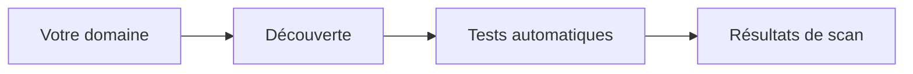

## Vue d'ensemble

La gestion de surface d'attaque, ou ASM, consiste à découvrir et surveiller en continu tout ce que votre organisation expose à internet : sites web, serveurs, APIs, sous-domaines, sans devoir lister manuellement chaque système au préalable.

Contrairement à un audit traditionnel, où vous indiquez exactement à Rifteo quoi tester, l'ASM part de ce qui est publiquement visible sur votre organisation et construit la liste d'actifs pour vous.

## Pourquoi c'est important

La plupart des organisations exposent plus de choses sur internet qu'elles ne le pensent : sous-domaines oubliés, environnements de staging ouverts ou services créés par une autre équipe. Chacun de ces éléments peut devenir un point d'entrée pour un attaquant.

L'ASM vous donne :

- **Visibilité continue** : au lieu d'une photo ponctuelle, vous obtenez une vue suivie de ce qui est exposé.
- **Aucune liste d'actifs manuelle requise** : Rifteo découvre les actifs pour vous, à partir de l'empreinte publique de votre organisation.
- **Alerte précoce** : toute exposition nouvelle ou modifiée est signalée dès sa découverte.

## Comment ça fonctionne

<Frame>
  
</Frame>

Vous donnez à Rifteo un point de départ, généralement le domaine principal de votre entreprise. À partir de là, Rifteo cartographie automatiquement ce qui est publiquement accessible et exposé à internet, puis lance les contrôles adaptés à ce qu'il trouve. Une application web n'est pas testée comme un serveur mail, par exemple, et vous n'avez rien à configurer.

- **Votre domaine** : point de départ utilisé par Rifteo pour lancer la découverte.
- **Découverte** : Rifteo cartographie ce qui est publiquement accessible depuis ce point.
- **Tests automatiques** : les contrôles adaptés sont appliqués selon ce qui est découvert (application web, API, serveur mail, etc.).
- **Résultats de scan** : tout ce qui est découvert et testé est compilé dans votre vue de résultats.

## Différences entre ASM et test d'intrusion

| | **ASM** | **Test d'intrusion** |
|---|---|---|
| **Cibles** | Aucune cible déclarée au départ ; elles sont découvertes automatiquement depuis votre domaine | Vous déclarez des cibles précises avant le début des tests |
| **Règles d'engagement** | Appliquées automatiquement selon ce qui est découvert | Définies manuellement par vous (actions interdites, événements redoutés, protections en place) |
| **Point de départ** | Votre domaine | Un périmètre que vous définissez étape par étape |
| **Idéal pour** | Visibilité continue sur tout ce que vous exposez | Test manuel approfondi d'un système spécifique |
| **Catégorie** | Évaluation de surface d'attaque | Test d'intrusion |

<Note>
L'ASM ne remplace pas un test d'intrusion : les deux sont complémentaires. L'ASM vous montre ce qui est exposé et mérite un examen plus poussé ; un test d'intrusion va en profondeur sur une cible précise que vous avez choisie.
</Note>

## Étapes suivantes

L'ASM est configuré par l'équipe Rifteo. Voir [Variantes de scan](/fr/scan-variants) pour comprendre les différents niveaux de scan disponibles.
