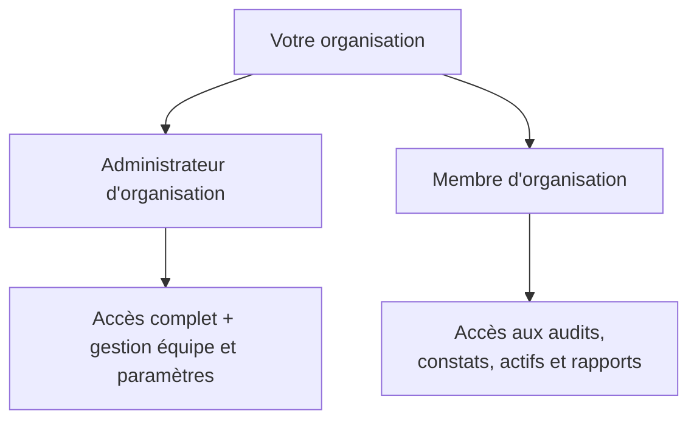

Chaque utilisateur Rifteo de votre organisation possède l'un des deux rôles suivants : **Administrateur d'organisation** ou **Membre d'organisation**. Cette page explique ce que chaque rôle peut voir et faire.

## Les rôles en bref

## Ce que les deux rôles peuvent faire

Les Administrateurs et les Membres d'organisation partagent la même vue sur la plupart de Rifteo :

- Consulter et parcourir les **audits**, les **constats** et les **rapports**
- Consulter l'**inventaire d'actifs**
- Gérer leurs propres **préférences de notification**
- Commenter les **fils d'audit**
- Consulter le **tableau de bord** et la vue d'ensemble de la posture de sécurité

## Ce qui est propre aux Administrateurs d'organisation

<Note>
Nous confirmons la liste exacte des actions réservées aux Administrateurs avec l'équipe produit. Cette section sera finalisée une fois vérifiée. D'après les éléments référencés ailleurs dans cette documentation, les Administrateurs sont censés gérer les paramètres au niveau organisation, comme les membres de l'équipe.
</Note>

- **Gestion de l'équipe** : inviter, retirer ou gérer les membres de votre organisation (voir [Gestion de l'équipe](/fr/team-management))
- **Modification des informations de l'organisation** : détails de l'entreprise, informations de contact

## FAQ

<AccordionGroup>
  <Accordion title="Les Membres d'organisation peuvent-ils inviter de nouveaux membres ?">
    La gestion de l'équipe est généralement réservée aux Administrateurs d'organisation. Voir [Gestion de l'équipe](/fr/team-management) pour plus de détails.
  </Accordion>
  <Accordion title="Puis-je modifier le rôle de quelqu'un après son arrivée ?">
    Cette action se fait depuis la gestion de l'équipe par un Administrateur d'organisation.
  </Accordion>
  <Accordion title="Qui doit être Admin ou Membre dans mon organisation ?">
    Les Admins sont généralement les personnes responsables de l'équipe et des paramètres du compte. Les Membres sont les personnes qui doivent consulter et traiter les résultats d'audit au quotidien.
  </Accordion>
</AccordionGroup>
