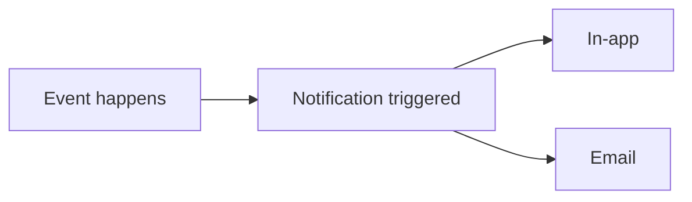

---
title: "In-App Notifications & Preferences"
description: "What notifications Rifteo sends, where you'll see them, and how to manage your preferences."
---

Rifteo keeps you updated on what's happening across your audits through notifications. This page explains what you'll be notified about and how to control it.

## Notification Categories

Notifications are grouped into four categories:

| Category | What it covers |
|---|---|
| **Audit lifecycle** | Status changes on your audits — e.g. started, moved to review, completed |
| **Comments & threads** | New comments on an audit thread |
| **Members & access** | Changes to your organisation's members or access |
| **System** | Platform-level updates and announcements |

## Notification Channels

Whenever something happens on your account, Rifteo can notify you in two ways:

- **In-app** — click the bell icon in the top navigation to open your notifications panel
- **Email** — sent to your account's registered email address

<Frame>
  
</Frame>

## Managing Your Preferences

Go to **Account Settings → Notification Preferences** to choose which notifications you receive and how.

<Frame>
  
</Frame>

For each of the four categories, you can toggle **In-app** and **Email** independently — so you're only notified the way you actually want to be.

## Security Notifications

<Note>
Security-related notifications are always sent and can't be turned off — this ensures you never miss something critical to your account's safety.
</Note>

## FAQ

<AccordionGroup>
  <Accordion title="Can I turn off all notifications?">
    You can toggle In-app and Email independently for each of the four categories, except **Security** notifications, which are always on.
  </Accordion>
  <Accordion title="Where do I manage my notification preferences?">
    Go to **Account Settings → Notification Preferences**.
  </Accordion>
  <Accordion title="Where do I find past notifications?">
    Click the bell icon in the top navigation to open your notifications panel.
  </Accordion>
</AccordionGroup>