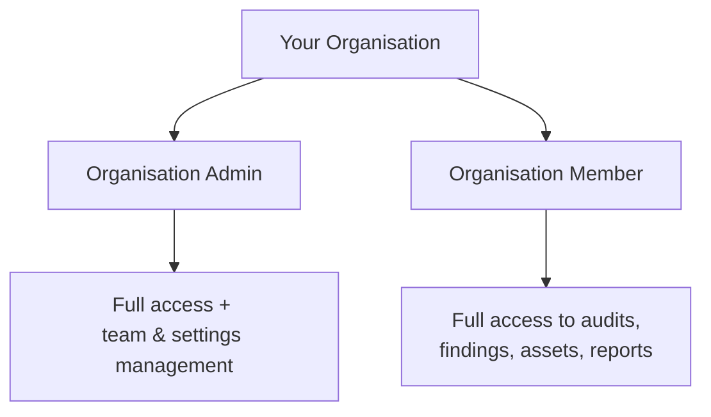

---
title: "Your Role"
description: "The difference between Organisation Admin and Organisation Member, and what each role can do."
---

Every Rifteo user in your organisation has one of two roles: **Organisation Admin** or **Organisation Member**. This page explains what each role can see and do.

## Roles at a Glance

## What Both Roles Can Do

Organisation Admins and Members share the same view across most of Rifteo:

- View and browse **audits**, **findings**, and **reports**
- View the **asset inventory**
- Manage their own **notification preferences**
- Comment on **audit threads**
- View the **dashboard** and security posture overview

## What's Specific to Organisation Admins

<Note>
We're confirming the exact list of Admin-only actions with the product team — this section will be finalized once verified. Based on what's referenced elsewhere in this documentation, Admins are expected to manage organisation-level settings such as team members.
</Note>

- **Team Management** — inviting, removing, or managing members of your organisation (see [Team Management](/team-management))
- **Editing organisation information** — company details, contact info

## FAQ

<AccordionGroup>
  <Accordion title="Can Organisation Members invite new team members?">
    Team management is typically restricted to Organisation Admins — see [Team Management](/team-management) for details.
  </Accordion>
  <Accordion title="Can I change someone's role after they've joined?">
    This is managed from Team Management by an Organisation Admin.
  </Accordion>
  <Accordion title="Who should be an Admin vs a Member in my organisation?">
    Admins are typically the people responsible for managing your team and account settings; Members are anyone who needs to view and act on audit results day-to-day.
  </Accordion>
</AccordionGroup>